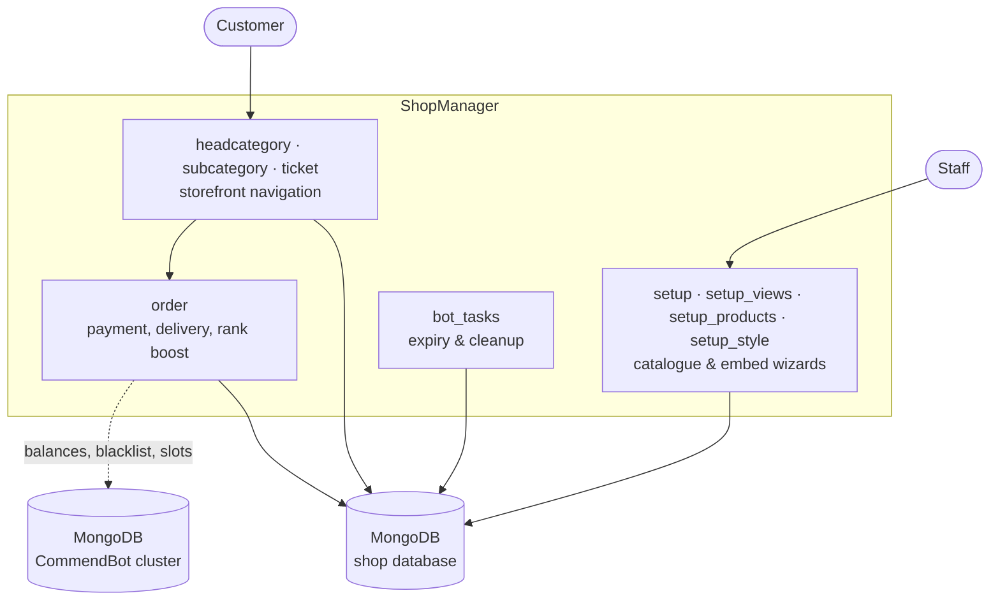

# ShopManager

A Discord bot that turns a guild into a storefront. Staff build a product
catalogue through menu-driven setup wizards; customers browse it, open a ticket,
pay, and receive their goods — all inside Discord, without a website.

It was built for the **r4p Services** (gameboosting.top) Discord and ran
alongside [CommendBot](https://github.com/PeterLinuxOSS/commendbot), which it
integrates with to sell CS:GO commends. The service has been retired; this
repository is an archive, published for reference. All credentials have been
removed and rotated.

## What it does

- **Catalogue** — head categories, subcategories and products, each with its own
  embed styling (title, description, colour, image, thumbnail, footer)
- **Storefront** — customers navigate the catalogue through select menus and
  buttons; there are almost no slash commands
- **Tickets** — a purchase opens a private channel, transcript-logged on close
- **Payments** — PayPal and CommendBot-balance flows, with a manual staff
  confirmation step
- **Delivery** — key/goods dispatch from stock, with per-product inventory
- **Rank boosting** — a CS:GO rank-boost product type priced per rank step
- **Subscriptions** — recurring reseller plans with expiry handling

## Architecture

ShopManager is menu-driven rather than command-driven: 41 selects, 14 views,
13 buttons and 4 modals against just a handful of slash commands. Almost all
state lives in MongoDB, and views are re-registered on startup from a
`refreshview` collection so components keep working across restarts.



The bot talks to **two separate MongoDB clusters**: its own, and the CommendBot
deployment's. The second one is how a customer can pay with an existing
CommendBot balance and how the shop checks the shared blacklist. It is optional
— leave `COMMENDBOT_MONGODB_URI` empty and the CommendBot-backed product types
simply become unavailable.

## Project layout

| Path | Contents |
| --- | --- |
| `main.py` | Entry point: loads cogs, owner reload command |
| `config.py` | All configuration — credentials, IDs, branding — from the environment |
| `cogs/setup.py` | The main setup wizard's cog — slash commands and startup registration |
| `cogs/setup_views.py` | The 22 select menus `setup.py` drives (split out; not a standalone extension) |
| `cogs/setup_products.py` | Product creation and pricing, including rank tiers |
| `cogs/setup_style.py` | Per-menu embed styling |
| `cogs/headcategory.py`, `cogs/subcategory.py` | Storefront category menus |
| `cogs/ticket.py`, `cogs/order.py` | Ticket lifecycle, payment and delivery |
| `cogs/helpers.py` | Shared prompts, ticket closing, transcripts |
| `cogs/bot_tasks.py` | Scheduled expiry and cleanup |
| `cogs/events.py` | Gateway listeners |
| `utils/` | Async (motor) database handles, embed builders, shared helpers |
| `tools/` | Standalone verification scripts |

## Setup

Requires Python 3.11 and MongoDB.

```bash
pip install -r requirements.txt
cp .env.example .env      # fill in the values
python main.py
```

`config.validate()` refuses to start unless `DISCORD_TOKEN` and `MONGODB_URI`
are set.

Everything the bot used to hardcode now lives in `config.py`: both database
URIs, the owner and guild IDs, log channels, branding, custom emoji and the
CS:GO rank tables. The defaults are the original deployment's identifiers and
serve as documentation; point them at your own guild before running.

## Verification

Two scripts under `tools/` validate the bot without a full deployment:

- `tools/load_check.py` — loads all 12 cogs into a real nextcord Bot and
  reports the command surface. Needs no live infrastructure: motor connects
  lazily, so MongoDB never has to be reachable just to import the cogs.
- `tools/exercise_db.py` — runs real insert/find/update/delete round trips
  against MongoDB through `utils.mongodb`, including the specific
  if/else-into-one-shared-loop cursor pattern used in `cogs/setup.py` (two
  branches assign the same variable name from `db.productsdb.find(...)`, one
  loop below consumes whichever ran), plus the pure helpers in
  `utils/variables.py`.

```bash
python3 tools/load_check.py
MONGODB_URI='mongodb://127.0.0.1:27017/shopmanager_test?directConnection=true' python3 tools/exercise_db.py
```

CI (`.github/workflows/python-package.yml`) runs both on every push — compile
check, lint, `load_check.py`, then `exercise_db.py` against a standalone
MongoDB service container (no replica set needed here, unlike CommendBot's
workflow — ShopManager doesn't use change streams).

Neither exercises interactive flows (select menus, modals, button callbacks)
— those only run against a live Discord interaction, and remain unverified
beyond code review.

## Known rough edges

Published honestly rather than polished into something it never was.

- **`eval()` on staff input.** `cogs/order.py` evaluates a staff-entered price
  formula with the bare `eval()` builtin. Staff-only and not customer-facing,
  but still arbitrary code execution; a real expression parser would close it.
  The two `except Exception:` blocks around it were left broad rather than
  narrowed, since `eval()` can raise almost anything.
- **One more `except Exception:`** remains around a third-party
  `steamid.steam64_from_url()` call, which has no documented exception
  contract to narrow against.
- **No tests for interactive flows.** The cogs load and the database layer is
  exercised directly (see Verification), but the select menus, modals and
  button callbacks that make up almost the entire bot have never run end to
  end outside of code review.

## License

MIT — see `LICENSE`.
