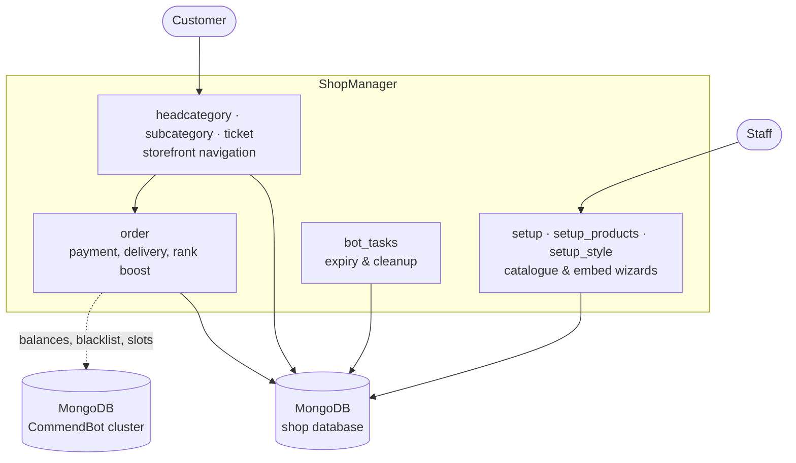

# ShopManager

A Discord bot that turns a guild into a storefront. Staff build a product
catalogue through menu-driven setup wizards; customers browse it, open a ticket,
pay, and receive their goods — all inside Discord, without a website.

It was built for the **r4p Services** (gameboosting.top) Discord and ran
alongside [CommendBot](https://github.com/PeterLinuxOSS/commendbot), which it
integrates with to sell CS:GO commends. The service has been retired; this
repository is an archive, published for reference. All credentials have been
removed and rotated.

## What it does

- **Catalogue** — head categories, subcategories and products, each with its own
  embed styling (title, description, colour, image, thumbnail, footer)
- **Storefront** — customers navigate the catalogue through select menus and
  buttons; there are almost no slash commands
- **Tickets** — a purchase opens a private channel, transcript-logged on close
- **Payments** — PayPal and CommendBot-balance flows, with a manual staff
  confirmation step
- **Delivery** — key/goods dispatch from stock, with per-product inventory
- **Rank boosting** — a CS:GO rank-boost product type priced per rank step
- **Subscriptions** — recurring reseller plans with expiry handling

## Architecture

ShopManager is menu-driven rather than command-driven: 41 selects, 14 views,
13 buttons and 4 modals against just a handful of slash commands. Almost all
state lives in MongoDB, and views are re-registered on startup from a
`refreshview` collection so components keep working across restarts.



The bot talks to **two separate MongoDB clusters**: its own, and the CommendBot
deployment's. The second one is how a customer can pay with an existing
CommendBot balance and how the shop checks the shared blacklist. It is optional
— leave `COMMENDBOT_MONGODB_URI` empty and the CommendBot-backed product types
simply become unavailable.

## Project layout

| Path | Contents |
| --- | --- |
| `main.py` | Entry point: loads cogs, owner reload command |
| `config.py` | All configuration — credentials, IDs, branding — from the environment |
| `cogs/setup.py` | Main setup wizard (the largest module) |
| `cogs/setup_products.py` | Product creation and pricing, including rank tiers |
| `cogs/setup_style.py` | Per-menu embed styling |
| `cogs/headcategory.py`, `cogs/subcategory.py` | Storefront category menus |
| `cogs/ticket.py`, `cogs/order.py` | Ticket lifecycle, payment and delivery |
| `cogs/helpers.py` | Shared prompts, ticket closing, transcripts |
| `cogs/bot_tasks.py` | Scheduled expiry and cleanup |
| `cogs/events.py` | Gateway listeners |
| `utils/` | Database handles, embed builders, shared helpers |

## Setup

Requires Python 3.11 and MongoDB.

```bash
pip install -r requirements.txt
cp .env.example .env      # fill in the values
python main.py
```

`config.validate()` refuses to start unless `DISCORD_TOKEN` and `MONGODB_URI`
are set.

Everything the bot used to hardcode now lives in `config.py`: both database
URIs, the owner and guild IDs, log channels, branding, custom emoji and the
CS:GO rank tables. The defaults are the original deployment's identifiers and
serve as documentation; point them at your own guild before running.

## Known rough edges

Published honestly rather than polished into something it never was.

- **Blocking database calls in async handlers.** `utils/mongodb.py` uses
  synchronous `pymongo` while every caller is a coroutine, so each query blocks
  the event loop. Moving to `motor` is the obvious next step and would touch
  every cog.
- **`cogs/setup.py` is 2,000 lines** and holds 23 UI component classes. It wants
  the same mixin split the CommendBot archive got.
- **No tests.** The cogs load and the command surface is verified, but the
  interactive flows have never been exercised automatically.
- **Error handling is broad.** 51 bare `except:` blocks were narrowed to
  `except Exception:`, which stops them swallowing `KeyboardInterrupt` and
  `CancelledError`, but they still swallow a lot.

## What changed when this was published

- Credentials removed and read from `.env` instead: the Discord token and **two**
  MongoDB URIs, both of which embedded the same account password. All rotated.
- Branding, log channels, owner/guild IDs, custom emoji and the CS:GO rank
  tables moved into `config.py`.
- Star imports replaced with explicit imports throughout, which made ruff's
  undefined-name check meaningful for the first time. Lint findings went from
  777 to 5.
- A 22 MB `nextcord.log` was dropped and the logger dialled back from `DEBUG`
  to `INFO` — DEBUG on nextcord writes every gateway event to disk, which is
  what produced it. Level and path are configurable now.
- ~210 lines of dead and commented-out code removed, plus a duplicated 18-item
  rank list that appeared four times in `cogs/order.py`.

Bugs found and fixed along the way:

- The embed colour picker never worked. `hex:str ;msg = helpers.waitforrespon(...)`
  was a bare annotation that never assigned `hex`, so `if hex:` tested the
  built-in function (always truthy) and wrote that function object to the
  database — and the coroutine was never awaited, so the confirmation crashed.
- A rank-boost ticket with neither `rankup` nor `derank` set left `options`
  unbound and raised `NameError` when the menu was rendered.
- `eranks` was misaligned against `nranks` by one: an unranked customer
  displayed as Silver 1, and a Silver 1 customer displayed as the raw text
  `"s1"`.
- A `insert_one` document set `"type"` twice, and a walrus binding was assigned
  and never read.

## License

MIT — see `LICENSE`.
